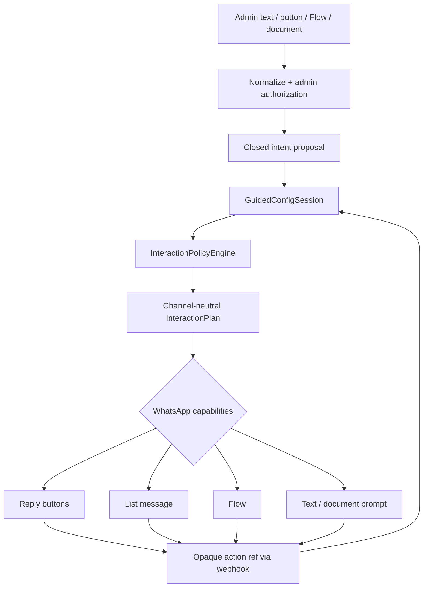

# Intent-Driven Interactive Admin Conversations

## Core decision

The admin bot must not let an LLM invent a WhatsApp button, choose the next
workflow stage or mutate configuration. It uses four separate concepts:

| Concept | Question it answers | Authority |
|---|---|---|
| **Admin intent** | “Owner ne yapmak istiyor?” | local LLM/parser proposes a closed enum |
| **Session state** | “Taslakta ne var, ne açık, ne onay bekliyor?” | server controller |
| **Interaction goal** | “Bot şimdi semantik olarak ne toplamalı?” | deterministic policy engine |
| **Surface** | “WhatsApp’ta nasıl gösterelim?” | channel renderer + capabilities |



The semantic plan is stable even when its visual representation changes. A
button is only one renderer option, not the business workflow itself.

## Typed interaction contract

The controlled parser may propose only a limited admin intent:

```text
add_offering | provide_value | upload_artifact | approve_proposal |
reject_proposal | close_collection | defer | unknown
```

The policy engine then produces an independent, typed goal. Examples:

```json
{
  "kind": "collection_continue",
  "collection": "offerings",
  "focus_path": ["offerings", "offering:ax-300"],
  "prompt_key": "offerings.continue",
  "allowed_actions": [
    "offerings.add_item",
    "artifacts.await_upload",
    "offerings.close"
  ]
}
```

```json
{
  "kind": "review_proposals",
  "artifact_id": "artifact-...",
  "proposal_ids": ["proposal-1", "proposal-2"],
  "allowed_actions": [
    "proposal.accept_selected",
    "proposal.resolve_conflicts",
    "proposal.reject"
  ]
}
```

The plan carries only an i18n prompt key, approved template values and enabled
server transitions. It does not carry a raw JSON Patch from the client or an
LLM-written UI payload.

## Policy: semantic locality before visual choice

Let the current controller state be:

\[
z=(\mathrm{phase},\ \mathrm{openCollections},\ \mathrm{draftRevision},\
\mathrm{pendingPreview},\ \mathrm{adminRole},\ \mathrm{channelCapabilities})
\]

and let `i` be a validated, closed intent proposal. The policy function is:

\[
g^* = \pi(z,i)
\]

where `g*` is a channel-independent `InteractionGoal`. It uses a
lexicographic priority rather than letting a language model choose freely:

1. authorization, expiry, invalid input and safety recovery;
2. pending preview, conflict or artifact review;
3. open collection gates;
4. questions nearest to the current graph focus;
5. required configuration information;
6. optional enrichment.

The collection gate is a hard constraint:

\[
\mathrm{offerings.state}=\mathrm{collecting}
\Rightarrow
g^*.kind \in
\{\mathrm{continueCollection},\ \mathrm{collectOffering},\
\mathrm{requestArtifact},\ \mathrm{reviewProposals},\ \mathrm{defer}\}
\]

Thus, after AX-300 is added, the bot asks about another item, an import, or
an explicit closure. It cannot jump to company tone, publishing or unrelated
settings merely because an LLM suggests it.

## WhatsApp surface compiler

The renderer receives only `InteractionPlan + ChannelCapabilities`:

| Goal | Preferred rendering | Safe fallback |
|---|---|---|
| 2–3 mutually exclusive actions | Reply buttons | numbered text |
| several single-choice options | List message | paginated/numbered text |
| several structured values | WhatsApp Flow | sequential short questions |
| Excel/PDF request | document prompt | text explaining attachment upload |
| many imported rows/conflicts | Flow or paginated preview | grouped text preview |
| ambiguous answer | free-text clarification | same |
| information only | text | same |

For example, the `collection_continue` goal renders to three reply buttons
when supported:

```text
AX-300 eklendi. Başka ürün, hizmet veya varyant var mı?

[Bir tane daha ekle] [Excel/PDF yükle] [Liste tamam]
```

If the same goal is rendered on a reduced-capability surface, it may become a
list or numbered text. Its enabled transition set remains exactly the same.

WhatsApp interactive messages support reply buttons and lists; Meta's hosted
SDK documents reply buttons as a small fixed choice set with a backend-readable
ID. [Interactive messages](https://whatsapp.github.io/WhatsApp-Nodejs-SDK/api-reference/messages/interactive/)
Flows are appropriate for multi-field form-like data entry, while document
uploads arrive as separate media messages. The Cloud API media collection
documents PDF and Excel document media types and the media retrieval flow.
[Media API collection](https://www.postman.com/meta/whatsapp-business-platform/folder/13382743-ecb27be5-4d27-4763-bbee-6a8002c04bf3)

“Excel/PDF yükle” is intentionally not a fake file-picker button. It moves the
session into an `await_document` state and tells the owner to attach the file;
the subsequent document webhook creates an `Artifact`, not a config mutation.

## Opaque action IDs and validation

Button labels, list labels, Flow fields and free text are never authoritative.
The server creates a short opaque action reference and stores its binding in
an interaction ledger:

```json
{
  "action_ref": "ia_...",
  "tenant_id": "tenant-...",
  "session_id": "cfg-session-...",
  "admin_id": "admin-...",
  "draft_revision": 17,
  "question_id": "offerings.continue",
  "transition": "offerings.close",
  "expires_at": "...",
  "nonce": "...",
  "status": "issued"
}
```

The short ref is what the WhatsApp surface carries. The server validates it
against the current session on return:

```text
validAction(e,z) =
  knownRef(e)
  ∧ correctTenantAndAdmin(e,z)
  ∧ correctSessionQuestionAndRevision(e,z)
  ∧ notExpired(e)
  ∧ notConsumed(e)
  ∧ e.transition ∈ enabledTransitions(z)
```

Only then may the controller call the state transition. It atomically marks
the action/event consumed; duplicate webhook delivery is a no-op.

```text
apply(e, z) mutates state only if validAction(e, z)
```

An LLM answer such as `intent=publish`, a forged action ID, a cross-admin
button click, an old button after the draft changes, or extra Flow fields are
all rejected or safely recovered. None can supply a JSON Patch directly.

## Key invariants

\[
\mathrm{LLMOutput}\not\Rightarrow\mathrm{DraftMutation}
\]

\[
\mathrm{Actions}(u) \subseteq \mathrm{EnabledActions}(z,\mathrm{role})
\]

\[
\mathrm{semantics}(\mathrm{render}(P,c_1))
= \mathrm{semantics}(\mathrm{render}(P,c_2))
= P.\mathrm{actions}
\]

\[
\mathrm{artifactReceived} \Rightarrow \Delta\mathrm{draft}=\varnothing
\]

\[
T(T(z,e),e)=T(z,e)
\]

The final equality expresses idempotence for at-least-once webhook delivery.

## Local E2E prototype

`experiments/interaction_policy_e2e.py` uses mock session state, intentions
and channel capabilities to test this compiler. It covers:

- collection continuation → reply buttons;
- five item choices → list;
- price/currency/tax → Flow, or text fallback without Flow support;
- document request → attachment prompt, not a config change;
- 17-row review → Flow or paginated fallback;
- forged, stale and cross-admin action rejection;
- duplicate action idempotence; and
- rejection of an unenabled `publish` transition.

It is a local design contract. The WhatsApp renderer, action ledger and
inbound normalizer must be implemented as backend modules only when the
current local-model-only scope is expanded.
