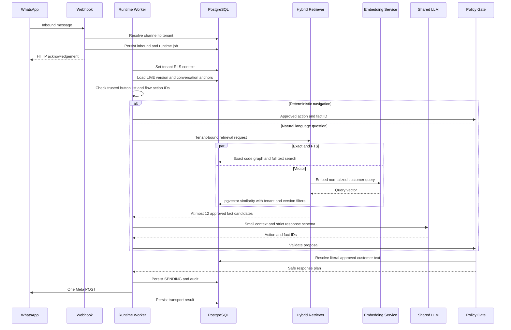
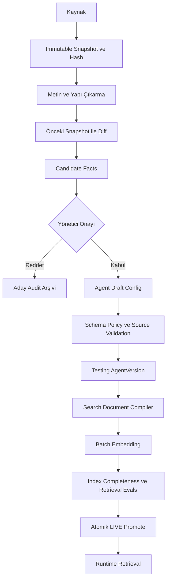

# Çok Şirketli Vector Retrieval Mimarisi

- **Durum:** Uygulandı — backend olarak pgvector yerine FalkorDB seçildi, bkz. [ADR-002](adr/ADR-002-falkordb-graphrag-retrieval.md). Güven sınırları, retrieval kanalları, RRF, versiyonlama ve kabul testleri bu belgedeki gibi uygulanmıştır.
- **Kapsam:** WhatsApp müşteri botu, şirket bilgi senkronizasyonu ve RAG
- **Ana karar:** PostgreSQL 16, pgvector ve PostgreSQL full text search ile tenant güvenli hybrid retrieval

## 1. Karar özeti

SalesWhatsappBot tek bir ortak LLM ve tek bir ortak embedding servisi kullanacaktır. Şirketler
model ağırlıklarıyla değil, her istekte sunucu tarafından bağlanan tenant, agent sürümü, bilgi
indeksi, politika ve araç yetkileriyle ayrılacaktır.

Vector arama bir gerçeklik kaynağı değildir. Yalnızca müşteri sorusuyla ilgili olabilecek onaylı
fact kayıtlarını aday olarak getirir. LLM bu adaylar içinden action ve fact ID seçer. Nihai yetki
kontrolü ve müşteri metninin oluşturulması trusted runtime tarafından yapılır.

İlk üretim seçimi ayrı bir vector database servisi değildir. Mevcut PostgreSQL altyapısına
`pgvector` eklenir. Teknik kodlar ve ölçüler için PostgreSQL full text ve exact arama, anlam
benzerliği için pgvector birlikte kullanılır.

## 2. Hedefler ve hedef dışı konular

### Hedefler

- Tek ortak LLM ile birden fazla şirketi güvenli biçimde çalıştırmak.
- Her istekte yalnızca doğru tenant ve LIVE agent sürümünün bilgisini kullanmak.
- Büyük ürün kataloglarında prompt'a bütün şirket konfigürasyonunu koymadan ilgili fact'leri bulmak.
- Ürün kodu, ölçü ve rulman kodlarında exact aramayı korumak.
- Doğal Türkçe, yazım hataları ve farklı ifade biçimlerinde anlamsal arama yapmak.
- Yeni veya değişmiş site içeriğini önce aday, sonra onaylı fact haline getirmek.
- İndeksleme, retrieval, LLM kararı ve gönderim zincirini denetlenebilir kılmak.
- Vector servisi bozulduğunda güvenli lexical fallback veya handoff kullanmak.

### Hedef dışı konular

- Şirket bilgisini LLM ağırlıklarına fine tune etmek.
- Raw web sayfasını doğrudan müşteri cevabı olarak kullanmak.
- Vector benzerliğini doğruluk, yetki veya teknik uygunluk kanıtı saymak.
- LLM'in tenant, agent sürümü veya araç kimliği seçmesine izin vermek.
- Her şirket için ayrı LLM veya ayrı uygulama süreci çalıştırmak.
- İlk aşamada Qdrant, Milvus, Pinecone veya ayrı bir Hermes servisi işletmek.

## 3. Üst seviye mimari

```mermaid
flowchart LR
    Customer[Müşteri] --> Meta[WhatsApp Cloud API]
    Meta --> Webhook[Webhook ve Tenant Resolver]
    Webhook --> Queue[Durable Runtime Job]

    Queue --> Context[Runtime Context Loader]
    Context --> Live[(AgentVersion JSONB)]
    Context --> State[(Konuşma State)]

    Context --> Router[Deterministik Router]
    Router -->|Menü veya action ID| Policy[Policy ve Evidence Gate]
    Router -->|Doğal soru| Retrieval[Hybrid Fact Retriever]

    Retrieval --> Exact[Exact Kod ve Graph Arama]
    Retrieval --> FTS[PostgreSQL Full Text]
    Retrieval --> Vector[(pgvector)]
    Exact --> Rank[Candidate Fusion ve Rerank]
    FTS --> Rank
    Vector --> Rank

    Rank --> LLM[Ortak LLM Sunucusu]
    LLM --> Policy
    Policy --> Renderer[Literal Response Renderer]
    Renderer --> Sender[At Most Once WhatsApp Sender]
    Sender --> Meta

    Sources[Site API PDF ve Yönetici] --> Sync[Knowledge Sync]
    Sync --> Staging[(Untrusted Candidate Store)]
    Staging --> Review[Yönetici İnceleme ve Onay]
    Review --> Live
    Live --> Indexer[Versioned Indexer]
    Indexer --> Vector
    Indexer --> FTS
```



Mimari iki ayrı bilgi hattı içerir:

1. **Runtime hattı:** Yalnızca onaylanmış ve ilgili LIVE sürüme bağlı fact kayıtlarını arar.
2. **Knowledge Ops hattı:** Site, API, PDF ve yönetici girdilerini güvenilmeyen aday veri olarak
   toplar; inceleme ve yayın sürecinden sonra runtime indeksine geçirir.

Raw ve onaylı bilgi aynı retrieval koleksiyonunda bulunmaz.

## 4. Güven sınırları

### 4.1 Tenant sınırı

Tenant müşteri metninden veya LLM cevabından belirlenmez. WhatsApp `phone_number_id`, doğrulanmış
WABA/channel binding ve webhook imzasından sunucu tarafında çözülür.

Her runtime işlemi aşağıdaki değişmez context ile başlar:

```text
RuntimeContext
  request_id
  tenant_id
  agent_id
  agent_version_id
  conversation_id
  channel_binding_id
  locale
  knowledge_index_generation
  allowed_tool_ids
  deadline
```

LLM çıktısında bulunan herhangi bir `tenant_id`, `agent_version_id` veya credential referansı yok
sayılır ve şema tarafından reddedilir.

### 4.2 Bilgi sınırı

Canonical gerçeklik kaynağı `AgentVersion.company_config` içindeki versiyonlanmış graph ve fact
kayıtlarıdır. Vector tablosu bu kaynağın yeniden üretilebilir türevidir.

Runtime indeksine yalnızca şu kayıtlar girebilir:

- `customer_visible = true`
- Yerel ayar için onaylı `customer_text` mevcut
- Fact'in `subject_id` referansı geçerli
- Agent sürümü publishability doğrulamasını geçmiş
- İçerik hash'i indeks kaydıyla eşleşiyor

Vector sonuçlarında dönen metin hiçbir zaman nihai müşteri cevabı değildir.

### 4.3 Eylem sınırı

LLM yalnızca küçük bir semantic proposal üretir:

```json
{
  "action": "reply",
  "fact_ids": ["approved-fact-id"]
}
```

Controller şu kontrolleri yapmadan cevap oluşturmaz:

- Fact mevcut tenant'a ait mi?
- Fact aktif agent sürümünde var mı?
- Fact müşteri görünür mü?
- Fact retrieval aday setinde mi?
- Action mevcut state ve politika tarafından izinli mi?
- Fact sorgulanan ürün veya konuya uygulanabilir mi?

Başarısız kontrol safe handoff veya deterministik clarification üretir.

## 5. Runtime istek akışı



### Sıralama

Bir müşteri turunda işlemler şu sırayı izler:

1. Webhook imzası ve kanal metadata doğrulanır.
2. `phone_number_id -> tenant_id -> agent_id` eşlemesi yapılır.
3. Tenant RLS context'i kurulur.
4. Aktif LIVE agent sürümü ve index generation yüklenir.
5. Güvenilir button, list veya Flow action ID varsa LLM atlanır.
6. Korunan intent'ler belirlenir: fiyat, stok, teslimat, garanti, sertifika, teknik uygunluk.
7. Exact, FTS ve vector retrieval paralel çalışır.
8. Sonuçlar birleştirilir, graph locality ve politika filtreleri uygulanır.
9. En fazla 12 aday fact LLM'e verilir.
10. LLM action ve en fazla iki fact ID seçer.
11. Policy gate seçimi yeniden doğrular.
12. Sunucu literal `customer_text` ve deterministik interaction üretir.
13. Mesaj audit ile birlikte at-most-once Meta sınırından gönderilir.

## 6. Hybrid retrieval tasarımı

Saf vector arama bu alan için yeterli değildir. Teknik kodlar, ölçüler ve ürün isimleri exact veya
lexical aramayı gerektirir.

### 6.1 Retrieval kanalları

| Kanal | Örnek | Rol |
|---|---|---|
| Trusted action | `product_detail:cast_pulley` | LLM kullanmadan kesin navigation |
| Exact code | `6211`, `DK240`, `TS160092` | Kod ve model eşleşmesi |
| Numeric normalization | `6,5 mm`, `6.5mm`, `320 çap` | Ölçü ve birim eşleştirmesi |
| Graph locality | Saptırma kasnağı sonrası `ölçüleri ne` | Aktif ürün ve ebeveyn facts |
| PostgreSQL FTS | `döküm kasnak ölçüleri` | Kelime ve kök tabanlı arama |
| Vector similarity | `halatın yönünü değiştiren parça` | Anlamsal yakınlık |

### 6.2 Candidate fusion

İlk sürümde skorların keyfi ağırlıklı toplamı yerine Reciprocal Rank Fusion kullanılmalıdır. Her
retriever sıralı aday listesi döndürür; fusion sonuçları ortak bir sıralamaya çevirir. Ardından:

- exact code eşleşmesine kesin öncelik,
- mevcut conversation subject'ine graph boost,
- korunan intent policy filtresi,
- aynı anlamı tekrarlayan fact'lerde deduplication,
- şirket geneli ve ürün facts arasında çeşitlilik sınırı

uygulanır.

### 6.3 Search document derleme

Embedding'e gönderilecek metin, onaylı config'den deterministik oluşturulur:

```text
company display name
offering display name ve onaylı interaction label
fact category
customer_text
onaylı search_terms
güvenli selection_guidance
```

Raw HTML, gizli `Fact.value`, credential, kaynak erişim bilgisi, sistem prompt'u ve yönetici notları
search document içine konmaz.

## 7. PostgreSQL ve pgvector veri modeli

### 7.1 Embedding profile

```text
knowledge_embedding_profiles
  id UUID PK
  name TEXT
  provider TEXT
  model_name TEXT
  dimension INTEGER
  distance_metric TEXT
  normalization_version TEXT
  status draft | active | retiring
  created_at TIMESTAMPTZ
```

Tek deployment aynı anda yalnızca bir `active` profile ile sorgu üretir. Model değişikliği mevcut
vektörlerle karıştırılmaz. Yeni profile için arka planda yeniden indeksleme yapılır; kabul testleri
geçince active profile atomik olarak değiştirilir.

### 7.2 Onaylı fact embeddings

```text
knowledge_fact_embeddings
  id UUID PK
  tenant_id UUID NOT NULL
  agent_id UUID NOT NULL
  agent_version_id UUID NOT NULL
  fact_id TEXT NOT NULL
  subject_id TEXT NOT NULL
  locale TEXT NOT NULL
  category TEXT NOT NULL
  search_document TEXT NOT NULL
  search_tsv TSVECTOR NOT NULL
  embedding_profile_id UUID NOT NULL
  embedding VECTOR(D) NOT NULL
  content_hash TEXT NOT NULL
  index_generation INTEGER NOT NULL
  customer_visible BOOLEAN NOT NULL
  created_at TIMESTAMPTZ
```

Önerilen kısıtlar:

```text
UNIQUE tenant_id agent_version_id fact_id locale embedding_profile_id
CHECK customer_visible = true
FOREIGN KEY agent_version_id -> agent_versions.id
```

Önerilen indeksler:

- `(tenant_id, agent_version_id, locale, embedding_profile_id)` B-tree
- `search_tsv` GIN
- `embedding` cosine index; veri hacmine göre exact scan veya HNSW

### 7.3 Knowledge source ve aday kayıtları

```text
knowledge_sources
  tenant_id
  source_type website | api | pdf | manual
  canonical_uri
  sync_policy
  enabled

knowledge_sync_runs
  tenant_id
  source_id
  started_at
  completed_at
  content_hash
  status
  audit

knowledge_candidates
  tenant_id
  source_id
  source_snapshot_id
  extracted_subject
  proposed_fact
  evidence_spans
  diff_type new | changed | removed
  review_status pending | accepted | rejected
```

Bu tablolar runtime fact retrieval sorgusunun parçası değildir.

## 8. İndeksleme ve yayınlama hattı



### 8.1 Publish protokolü

1. Draft config doğrulanır ve immutable testing version oluşturulur.
2. Her customer-visible fact için locale bazlı search document derlenir.
3. `content_hash` mevcutsa aynı embedding tekrar üretilmez.
4. Batch embedding job tenant ve version bağlamında çalışır.
5. Beklenen fact sayısı ile indeks satırları karşılaştırılır.
6. Golden retrieval testleri ve cross-tenant negatif testleri çalışır.
7. İndeks `ready` olmadan agent version LIVE yapılamaz.
8. LIVE promote, agent version ve `index_generation` pointer'ını birlikte değiştirir.
9. Eski indeks sürümü rollback ve audit için korunur; retention politikasıyla daha sonra temizlenir.

### 8.2 Yeni ürün bulma

Site sync yeni bir ürün bulduğunda bot bunu doğrudan müşteriye açmaz:

```text
Yeni sayfa veya ürün
  -> untrusted candidate
  -> kaynak ve değişiklik özeti
  -> yönetici kabulü
  -> draft AgentVersion
  -> test ve indeksleme
  -> LIVE yayın
```

Güvenilir, şemalı bir şirket API'si için politika kontrollü otomatik kabul ileride eklenebilir. Raw
web sayfası varsayılan olarak insan incelemesi gerektirir.

## 9. Tenant izolasyonu

### 9.1 Zorunlu kurallar

- Embedding tablosundaki her satır `tenant_id UUID NOT NULL` taşır.
- Tabloya mevcut app rolü için RLS uygulanır.
- Repository sorgusu ayrıca explicit `tenant_id` ve `agent_version_id` filtresi içerir.
- Worker job payload'ındaki tenant, DB'deki job satırıyla doğrulanır.
- Vector sorgusu modelin ürettiği tenant filtresini kabul etmez.
- Cache anahtarı tenant, agent version, embedding profile ve query hash içerir.
- Retrieval audit kayıtları tenant scoped tutulur.
- Tool credential ve channel binding hiçbir zaman vector metadata içinde tutulmaz.

Örnek cache anahtarı:

```text
retrieval:{tenant_id}:{agent_version_id}:{profile_id}:{locale}:{query_hash}
```

### 9.2 ANN ve filtreleme

Başlangıçta tenant ve sürüm filtresinden sonra exact cosine scan tercih edilmelidir. Tenant başına
fact sayısı küçükken bu yöntem hızlı, basit ve recall açısından kesindir.

Hacim büyüdüğünde:

1. `tenant_id` hash partitioning ile sorgu alanı daraltılır.
2. Partition başına HNSW index değerlendirilir.
3. HNSW recall, tenant filtreleri altında golden testlerle ölçülür.
4. Exact scan ile sonuç farkı kabul eşiğini aşarsa ANN devreye alınmaz.

Bu yaklaşım küçük tenant'ların büyük tenant'ların indeks yoğunluğunda kaybolmasını engeller.

## 10. Bileşenler ve kod sınırları

Önerilen yeni portlar:

```python
class EmbeddingClient(Protocol):
    async def embed_query(self, text: str) -> Embedding: ...
    async def embed_documents(self, texts: list[str]) -> list[Embedding]: ...


class FactRetriever(Protocol):
    async def retrieve(self, request: RetrievalRequest) -> list[FactCandidate]: ...
```

Önerilen modüller:

```text
apps/api/src/integrations/embeddings.py
apps/api/src/modules/knowledge/models.py
apps/api/src/modules/knowledge/repository.py
apps/api/src/modules/knowledge/compiler.py
apps/api/src/modules/knowledge/indexer.py
apps/api/src/modules/knowledge/retrieval.py
apps/api/src/modules/knowledge/service.py
apps/api/src/workers/knowledge_index.py
apps/api/src/workers/knowledge_sync.py
```

Mevcut `company_runtime._visible_facts` davranışı `LexicalGraphFactRetriever` olarak korunur.
`HybridFactRetriever`, exact, FTS, vector ve graph retriever'ları birleştirir. Böylece vector
servisi kapalıyken mevcut güvenli davranış kullanılabilir.

`CompanyAgentRuntime` doğrudan pgvector SQL'i bilmez; yalnızca `FactRetriever` portundan onaylı
adaylar alır. Bu sınır ileride pgvector yerine başka bir backend kullanmayı mümkün kılar.

## 11. Shared model topolojisi

```text
Tüm tenant istekleri
  -> tenant-aware fair queue
  -> ortak embedding service
  -> ortak LLM inference service
```

- Embedding modeli şirket bilgisi tutmaz; aynı metni aynı profile göre vektörleştirir.
- LLM stateless kabul edilir; şirket hafızası prompt dışındaki store'larda yaşar.
- Tenant başına concurrency ve token kotası uygulanır.
- Büyük bir tenant'ın diğer tenant'ları bloke etmemesi için weighted fair queue kullanılır.
- Application cache tenant'lar arasında paylaşılmaz.
- Model sunucusunun ortak prefix veya KV optimizasyonu güvenlik otoritesi değildir.

Embedding modeli deployment ayarıdır. İlk seçim Türkçe ve teknik katalog golden seti üzerinde
ölçülmelidir. Model adı ve dimension kod içine sabitlenmez; active embedding profile'dan okunur.

## 12. Arıza ve fallback davranışı

| Arıza | Davranış |
|---|---|
| Embedding servisi zaman aşımı | Exact, FTS ve graph retrieval ile devam et |
| pgvector sorgu hatası | Lexical graph fallback; sonuç yoksa handoff |
| İndeks sürümü LIVE config ile eşleşmiyor | Mesaj üretme; safe handoff ve alarm |
| Aday fact doğrulaması başarısız | Fact'i reddet; diğer adaylarla devam et veya handoff |
| LLM bozuk JSON döndürüyor | Mevcut deterministic unknown-fact action |
| Meta POST sonucu belirsiz | Otomatik tekrar gönderme |
| Knowledge sync bozuluyor | Mevcut LIVE sürüm çalışmaya devam eder |

Retrieval hatası hiçbir durumda bütün fact store'un prompt'a eklenmesine yol açmaz.

## 13. Gözlemlenebilirlik

Her retrieval turunda aşağıdakiler audit edilebilir olmalıdır:

```text
request_id
tenant_id
agent_version_id
index_generation
embedding_profile_id
normalized_query_hash
retriever timings
exact FTS vector candidate IDs ve rank'ler
fusion sonucu
LLM'e verilen fact IDs
LLM'in seçtiği fact IDs
policy tarafından reddedilen IDs ve nedenleri
final action
total latency
```

Raw müşteri metni ve kişisel veri için ayrı retention ve redaction politikası uygulanır.

Temel metrikler:

- Retrieval p50 ve p95 latency
- Recall@5 ve Recall@12
- Mean Reciprocal Rank
- Exact fact-set accuracy
- Unsupported fact acceptance sayısı
- Cross-tenant candidate sayısı
- LIVE version ile index mismatch sayısı
- Embedding/index lag
- Prompt'a giren ortalama fact ve token sayısı
- Tenant başına LLM ve embedding kullanımı

## 14. Kabul testleri

Vector retrieval aşağıdaki testler geçmeden üretime alınmaz:

### Fonksiyonel

- Türkçe paraphrase doğru fact'i ilk 5 sonuçta getirir.
- Ürün ve rulman kodları exact eşleşir.
- Virgüllü ve noktalı ondalık ölçüler normalize edilir.
- Takip sorusu conversation subject'inden kopmaz.
- Fiyat, stok, teslimat ve uygunluk sorguları policy gate'i atlayamaz.

### Tenant güvenliği

- Tenant A sorgusu, Tenant B fact ID'sini hiçbir candidate listesinde göremez.
- Bilinen yabancı fact ID doğrudan sorulsa bile sonuç vermez.
- RLS context pool reuse sonrasında sızmaz.
- Cache anahtarı manipülasyonu cross-tenant sonuç üretmez.
- Modelin ürettiği tenant veya sürüm kimliği yok sayılır.

### Versiyonlama

- Draft ve testing fact'leri LIVE sorguda görünmez.
- Yeni LIVE sürüm ile index generation aynı anda değişir.
- Rollback eski fact ve embedding setini eksiksiz geri getirir.
- Embedding model değişikliği farklı profile vektörlerini karıştırmaz.

### Güvenlik

- Crawled sayfadaki prompt injection policy veya action üretemez.
- `customer_visible = false` fact hiçbir aşamada LLM context'ine girmez.
- Vector sonucu doğrudan customer text olarak gönderilemez.
- Silinmiş veya değiştirilmiş fact'in eski embedding'i LIVE sorguda kullanılamaz.

## 15. Uygulama fazları

### Faz 1 Temel pgvector retrieval

- PostgreSQL image veya kuruluma pgvector extension ekle.
- Python `pgvector` SQLAlchemy entegrasyonunu ekle.
- Embedding profile ve approved fact embedding tablolarını oluştur.
- `EmbeddingClient` ve `FactRetriever` portlarını ekle.
- Exact, FTS, vector ve RRF tabanlı hybrid retrieval geliştir.
- Mevcut lexical retriever'ı fallback olarak koru.
- Tenant RLS ve cross-tenant testlerini ekle.

### Faz 2 Versioned indexing

- Testing version publish öncesi batch indeksleme job'u ekle.
- Content hash ile idempotent upsert ve reuse ekle.
- Index completeness gate ve atomik LIVE activation ekle.
- Rollback ve embedding profile migration testlerini ekle.

### Faz 3 Knowledge sync

- Tenant source registry, immutable snapshot ve diff hattını ekle.
- Yeni, değişmiş ve kaldırılmış ürün adaylarını çıkar.
- Admin review ve draft patch akışını bağla.
- Raw candidate ve approved runtime index ayrımını zorla.

### Faz 4 Ölçek ve kalite

- Tenant hash partition ve HNSW deneyini gerçek hacimde ölç.
- Gerekirse küçük bir cross-encoder reranker dene.
- Weighted fair queue, tenant kotası ve retrieval cache ekle.
- Golden Türkçe corpus'u şirket ve sektör çeşitliliğiyle genişlet.

## 16. Açık kararlar

Uygulamadan önce aşağıdakiler ADR veya deployment ayarı olarak netleştirilmelidir:

- İlk embedding modeli ve dimension değeri
- Embedding servisinin Ollama, llama.cpp veya ayrı bir servis olması
- Raw snapshot dosyalarının yerel disk veya S3 uyumlu storage'da tutulması
- Tenant başına beklenen fact ve belge hacmi
- Knowledge source'larda otomatik kabul edilebilecek güvenilir API listesi
- Eski embedding sürümlerinin retention süresi
- Faz 1 için exact scan'den ANN'e geçiş metriği

Bu açık kararlar temel güvenlik mimarisini değiştirmez. Tenant, version, evidence ve literal render
sınırları backend veya embedding modeli değişse de sabit kalır.
